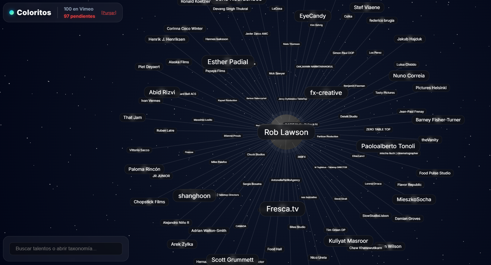
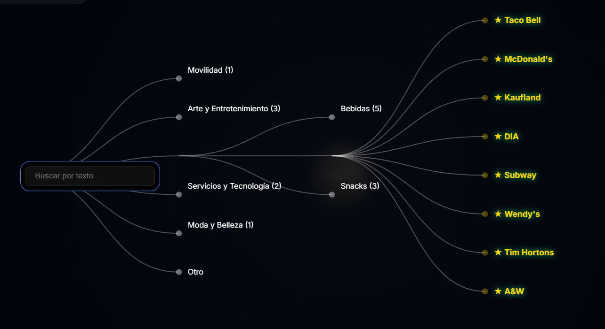
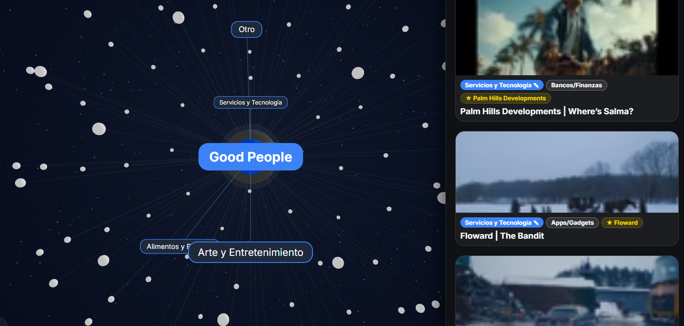

# 🌌 Coloritos Scouter

**Coloritos Scouter** es una plataforma de scouting visual de próxima generación. Transforma tu base de datos de comerciales y videos de Vimeo en un universo 3D altamente interactivo, permitiendo descubrir, filtrar y re-clasificar directores y marcas usando Inteligencia Artificial.



## ✨ Características Principales

*   **Universo 3D Espacial (React Three Fiber):** Navega por un cosmos dinámico donde los directores de cine son estrellas centrales y sus dominios de trabajo orbitan a su alrededor.
*   **Árbol Taxonómico D3:** Un buscador global interactivo que despliega un árbol de decisiones expansible, conectando *Categorías Principales*, *Subcategorías* y *Marcas* mediante perfectas curvas Bezier.
*   **Auto-Clasificación por IA:** Integrado con **Google Gemini (Vision)** para analizar los metadatos de los videos entrantes y auto-asignarles taxonomías maestras de 3 niveles.
*   **Soberanía de Datos (Retagging):** Un menú "Glassmorphism" nativo de intercepción de eventos para anular las decisiones de la IA y crear ramas personalizadas en tiempo real.
*   **Navegación Keyboard-First:** Invocación del buscador autocompletado y limpieza visual con el simple acto de empezar a teclear.

---

## 📸 Interfaz y Experiencia de Usuario (UX)

### 1. El Árbol de Filtros (Taxonomía D3)
Un árbol colapsable impulsado de manera puramente *Data-Driven*. Haciendo uso de *Negative Space Navigation*, los nodos padres se desvanecen automáticamente al ser seleccionados para cederle todo el protagonismo a las sub-ramas (Las Marcas) recién reveladas.



### 2. Panel de Scouting & Retag
Navega video por video en el panel lateral de Glassmorphism, previsualiza los comerciales y edita manualmente el Universo, la Categoría y la Marca comercial (ej: Johnnie Walker, Ciroc) con cajas de texto `inline` super rápidas.



---

## 🛠️ Tecnologías y Stack

*   **Motor Frontend:** React 18, Vite.
*   **Renderizado 3D Interactivo:** `@react-three/fiber`, `d3-force-3d`, `three.js`.
*   **Grafo 2D SVG:** `react-d3-tree` (customizado).
*   **Cognición / Inteligencia Artificial:** `@google/genai` (Modelo Gemini Pro).
*   **Base de Datos Nativa:** `localforage` (IndexedDB) para caching rápido de hasta miles de nodos.

---

## 🚀 Instalación y Despliegue

1. Clona este repositorio y navega a la carpeta:
   ```bash
   git clone https://github.com/TuUsuario/coloritos-scouter.git
   cd coloritos-scouter
   ```

2. Instala el universo de dependencias:
   ```bash
   npm install
   ```

3. Crea un archivo oculto `.env` en la raíz del proyecto para conectar los motores (nunca subas este archivo a GitHub):
   ```env
   VITE_VIMEO_TOKEN=tu_token_secreto_de_vimeo
   VITE_GEMINI_API_KEY=tu_token_secreto_de_gemini
   ```

4. Levanta los propulsores del entorno de desarrollo:
   ```bash
   npm run dev
   ```

## 🔒 Privacidad y Persistencia
Coloritos asume la extrema Soberanía de los Datos. Si rechazas el veredicto de la inteligencia artificial, tus modificaciones manuales reconstruirán el árbol taxonómico manipulando tu IndexedDB local. Las contraseñas API nunca abandonan el ámbito local a menos que se escuden detrás de un Backend seguro en producción.
